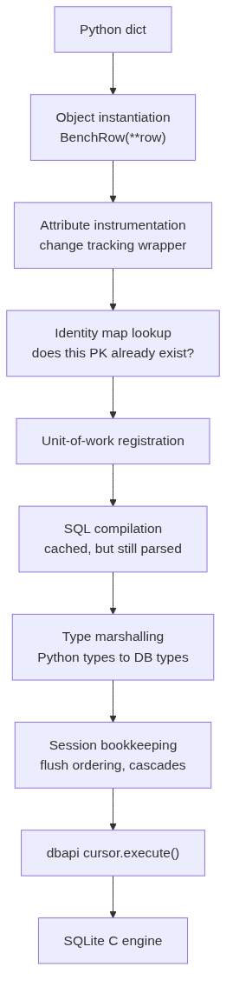
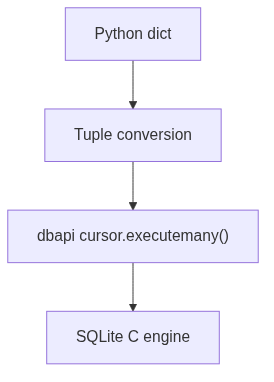
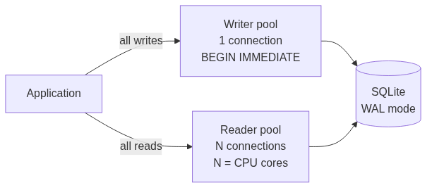
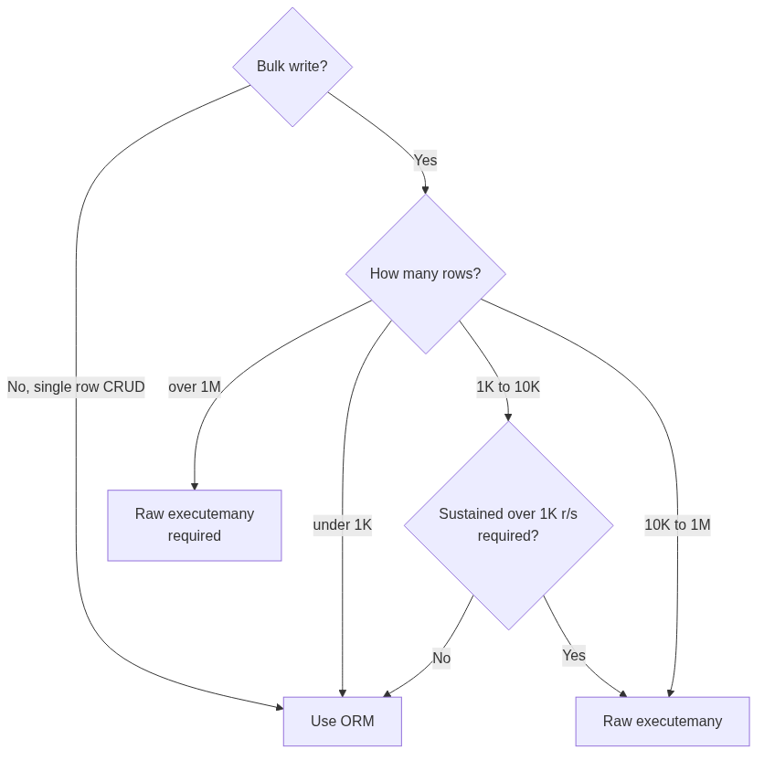

# Your ORM is the bottleneck

SQLite handles 88,000 writes per second on commodity hardware. My ORM caps at 3,800. PRAGMA tuning does not move that number.

I learned this the hard way, over 9.4 hours of benchmarking. 11 SQLite configurations, 230 million rows, 37 measured datapoints. Across every config I threw at it, ORM throughput landed between 3,045 and 3,821 rows per second. A 26% spread on the thing every guide on the internet is busy tuning. Same workload, rewritten as raw `executemany`, did 87,893.

The database was fine. It was always fine.

## The headline numbers

| Path | 10M rows | 50M rows | p99 latency |
|------|----------|----------|-------------|
| SQLAlchemy ORM | 3,696 r/s (45 min) | 3,682 r/s (3.8 hrs) | 1,492 ms |
| Raw `executemany` | 87,893 r/s (1.9 min) | 65,742 r/s (12.7 min) | 478 ms |
| **Speedup** | **23.8×** | **17.9×** | **3.1×** |

Zero errors across all runs. Every config. Every scale.

What I actually ran:

- 9.4 hours of continuous benchmarking
- 230 million rows written across all runs
- 11 configurations × 3 checkpoints + 2 paths × 2 scales = 37 datapoints
- Single host, NVMe storage, fresh database file per run

## Why I started running this

SQLite is having a moment. Rails 8 [ships with it](https://rubyonrails.org/2024/11/7/rails-8-no-paas-required) as a first-class production database. Kent C. Dodds [moved off a Postgres cluster](https://kentcdodds.com/blog/i-migrated-from-a-postgres-cluster-to-distributed-sqlite-with-litefs) to run it. Expensify is doing [4 million queries per second](https://use.expensify.com/blog/scaling-sqlite-to-4m-qps-on-a-single-server) on a single SQLite file. Cloudflare D1 runs it at the edge with [8 ms P99 reads](https://dev.to/whoffagents/cloudflare-d1-sqlite-at-the-edge-after-6-months-in-production-551j).

So I sat down to tune mine. WAL, mmap, cache size, sync mode, the usual PRAGMA folklore. I had a question I wanted answered, and it was not the one most blogs answer.

Most blogs tune SQLite. I wanted to know whether any of that tuning matters when you write through an ORM.

It does not. Not even a little.

## What I tested it on

| Component | Spec |
|-----------|------|
| CPU | 8-core / 16-thread |
| RAM | 23.2 GB DDR |
| Storage | Samsung 990 EVO Plus 1TB NVMe |
| OS | Linux 6.8.0 |
| Python | 3.11 |
| SQLAlchemy | 2.0 (sync) |
| SQLite | WAL mode, QueuePool |
| Schema | Single table, 11 columns, UUID primary key |

Everything ran on the same machine, same NVMe, same kernel. No Docker. No network. Local SQLite, period.

## The two benchmarks

Two harnesses, two questions.

**Config sweep.** 11 SQLite configurations, 10M rows each, all through SQLAlchemy. Does PRAGMA tuning matter?

**Before / after.** Same workload, ORM path vs raw `executemany`, at 10M and 50M. How much throughput does the ORM cost?

### The ORM path

```python
# Insert phase: bulk_save_objects
session.bulk_save_objects([BenchRow(**row) for row in chunk])
session.commit()

# Upsert phase: insert().on_conflict_do_update()
stmt = insert(BenchRow).values(chunk)
stmt = stmt.on_conflict_do_update(
    index_elements=["tenant_id", "entity_id", "sub_entity_id", "bucket_index"],
    set_={col: stmt.excluded[col] for col in update_cols}
)
session.execute(stmt)
session.commit()
```

### The raw path

```python
# sqlite3.executemany via the dbapi connection. Skips SQLAlchemy entirely.
raw_conn = session.connection().connection.dbapi_connection
cursor = raw_conn.cursor()
cursor.executemany(
    "INSERT INTO bench_rows (row_id, tenant_id, entity_id, ...) VALUES (?, ?, ?, ...)",
    rows_as_tuples
)
raw_conn.commit()
```

Both paths use the same generator, same schema, same target row count. The only difference is whether SQLAlchemy is in the picture.

### Schema

A single 11-column table, designed to look like a real production table rather than a synthetic benchmark.

| Column | Type | Role |
|--------|------|------|
| `row_id` | String(36) | UUID primary key |
| `tenant_id` | String(36), indexed | Logical sharding key |
| `entity_id` | Integer | Natural-key component |
| `sub_entity_id` | Integer | Natural-key component |
| `bucket_index` | Integer | Natural-key component |
| `measurement_x / y / z` | Float | Numeric payload |
| `category_id` | Integer | Categorical field |
| `weight` | Float | Probabilistic payload |
| `status` | Integer | State machine field |
| `created_at / updated_at` | DateTime | Tracking timestamps |

Unique constraint on `(tenant_id, entity_id, sub_entity_id, bucket_index)`, which is the upsert conflict target. Row size lands around 500 bytes including the UUID.

### Data generation

A streaming generator that yields chunks of unique rows with deterministic natural keys. Constant memory regardless of total scale. It never materialises the full row set.

```python
def streaming_chunks(total_rows, chunk_size):
    counter = 0
    while counter < total_rows:
        chunk = []
        for _ in range(chunk_size):
            chunk.append({
                "row_id": uuid4().hex,
                "tenant_id": tenant_id,
                "entity_id": counter % 1000,
                "sub_entity_id": (counter // 1000) % 1000,
                "bucket_index": counter // 1_000_000,
                # ... numeric and categorical fields
            })
            counter += 1
        yield chunk
```

The determinism matters. Re-running the same generator produces identical natural keys, which forces the upsert path to actually exercise ON CONFLICT instead of trivially inserting fresh rows. Without this, you are benchmarking inserts and calling it an upsert benchmark.

### Checkpoints and recovery

Results saved at 3M, 5M, and 10M for the config sweep. 10M and 50M for the before / after. Intermediate JSON written after each segment, with `--resume` to pick up where we left off. The 50M ORM run took 3.8 hours. The laptop suspended once. The resume capability paid for itself.

### How much compute went into this

| Phase | Duration | Rows | Datapoints |
|-------|----------|------|------------|
| Config sweep (11 configs × 10M) | 5.6 hours | 110M | 33 |
| Before / after (10M + 50M, both modes) | 3.8 hours | 120M | 4 |
| **Total** | **9.4 hours** | **230M** | **37** |

Single host, single process at a time. Background `psutil` sampler at 1Hz throughout. Each config got a freshly created database file via `tempfile.TemporaryDirectory()`, so no run was polluted by any prior run.

## Benchmark 1: the config sweep

11 SQLite configurations, 10 million rows each, all written through SQLAlchemy.

| Config | Chunk size | Sync | Cache | Pool | mmap |
|--------|-----------|------|-------|------|------|
| baseline | 5,000 | NORMAL | -4096 | 5 | 0 |
| chunk_1000 | 1,000 | NORMAL | -64000 | 5 | 256MB |
| chunk_5000 | 5,000 | NORMAL | -64000 | 5 | 256MB |
| chunk_10000 | 10,000 | NORMAL | -64000 | 5 | 256MB |
| chunk_25000 | 25,000 | NORMAL | -64000 | 5 | 256MB |
| chunk_50000 | 50,000 | NORMAL | -64000 | 5 | 256MB |
| optimized | 10,000 | NORMAL | -64000 | 5 | 256MB |
| aggressive | 25,000 | OFF | -64000 | 5 | 256MB |
| pool_3 | 10,000 | NORMAL | -64000 | 3 | 256MB |
| pool_5 | 10,000 | NORMAL | -64000 | 5 | 256MB |
| pool_8 | 10,000 | NORMAL | -64000 | 8 | 256MB |

### Results at 10M rows

| Config | Throughput | p99 latency | Peak RSS | Errors |
|--------|-----------|-------------|----------|--------|
| chunk_1000 | 3,821 r/s | 313 ms | 790 MB | 0 |
| baseline | 3,802 r/s | 1,418 ms | 195 MB | 0 |
| chunk_5000 | 3,673 r/s | 1,500 ms | 511 MB | 0 |
| chunk_10000 | 3,621 r/s | 2,887 ms | 610 MB | 0 |
| optimized | 3,576 r/s | 2,982 ms | 611 MB | 0 |
| pool_5 | 3,574 r/s | 2,960 ms | 609 MB | 0 |
| pool_8 | 3,573 r/s | 2,957 ms | 606 MB | 0 |
| pool_3 | 3,445 r/s | 3,200 ms | 610 MB | 0 |
| chunk_25000 | 3,262 r/s | 8,490 ms | 629 MB | 0 |
| aggressive | 3,243 r/s | 8,536 ms | 595 MB | 0 |
| chunk_50000 | 3,045 r/s | 20,508 ms | 633 MB | 0 |

Three things to notice.

The first is the spread. Best to worst, 3,821 vs 3,045 rows per second. That is 26% across configs that range from `sync=OFF` to default PRAGMAs, from 1K to 50K chunk sizes, from 3 to 8 pool connections. Whatever PRAGMA folklore you have read, on this workload, it is doing roughly nothing. The ORM is consuming the CPU budget before I/O becomes a factor.

The second is `aggressive`, which I configured with `sync=OFF` and 25K chunks expecting it to win. It came second-from-last at 3,243 r/s. I sacrificed durability for nothing. Forward Email [found the same thing](https://forwardemail.net/en/blog/docs/sqlite-performance-optimization-pragma-chacha20-production-guide): `sync=OFF` is sometimes slower than NORMAL because the WAL machinery is different, not just absent. Shivek Khurana [calls the difference "not very significant"](https://shivekkhurana.com/blog/sqlite-in-production/). It is not.

The third is pool size. `pool_3`, `pool_5`, `pool_8`: 3,445 / 3,574 / 3,573. Under 4% spread. SQLite is single-writer no matter how many connections you open. SQLAlchemy's QueuePool just serialises writes at the application layer, which is functionally identical to the [single-writer architecture](https://emschwartz.me/psa-your-sqlite-connection-pool-might-be-ruining-your-write-performance/) every production SQLite deployment converges on.

Baseline wins on the throughput-per-resource ratio. 5K chunks, default PRAGMAs, pool of 5. 3,802 r/s using only 195 MB of RSS. `chunk_1000` ekes out 0.5% more throughput but uses 4× the memory. Not a trade I am taking.

## Benchmark 2: ORM vs raw SQL

| Method | Scale | Throughput | Duration | p99 | Peak RSS |
|--------|-------|-----------|----------|-----|----------|
| ORM | 10M | 3,696 r/s | 45.1 min | 1,492 ms | 177 MB |
| ORM | 50M | 3,682 r/s | 226.3 min | 1,563 ms | 177 MB |
| Raw `executemany` | 10M | 87,893 r/s | 1.9 min | 478 ms | 155 MB |
| Raw `executemany` | 50M | 65,742 r/s | 12.7 min | 853 ms | 188 MB |

23.8× at 10M. 17.9× at 50M. Three and a half hours of wall time turn into thirteen minutes.

### Where the ORM time goes

Every row through SQLAlchemy goes through this:



Raw `executemany` does this:



Two layers, seven gone. None of the seven are free. Each one is a Python attribute access, a dict lookup, a function call, something the JIT cannot inline because of how SQLAlchemy is structured. On a one-shot insert it is invisible. On 10 million rows it costs 43 minutes.

### Scaling behaviour, both paths

ORM throughput is flat. 3,696 r/s at 10M. 3,682 r/s at 50M. I/O doesn't get a vote because the ORM is busy.

Raw throughput degrades at scale, which is interesting. 87,893 r/s at 10M, 65,742 r/s at 50M. That is a 25% drop. The database file grew from 3.8 GB to 19.5 GB, the B-tree got deeper, WAL checkpoints got more expensive. This is SQLite's actual I/O scaling curve. The ORM never gets close enough to it to see it.

## Chunk size controls latency, not throughput

Of all the things I tuned, chunk size was the only one that mattered, and not for the reason I expected.

| Chunk size | Throughput | p99 | Ratio |
|-----------|-----------|-----|-------|
| 1,000 | 3,821 r/s | 313 ms | 1.0× |
| 5,000 | 3,673 r/s | 1,500 ms | 4.8× |
| 10,000 | 3,621 r/s | 2,887 ms | 9.2× |
| 25,000 | 3,262 r/s | 8,490 ms | 27.1× |
| 50,000 | 3,045 r/s | 20,508 ms | 65.5× |

p99 scales linearly with chunk size. 50× larger chunks, 66× worse p99. Throughput moves 20%.

Each chunk is one transaction. Larger transactions hold the write lock longer, block WAL checkpoints longer, allocate more memory. The SQLite write lock is exclusive. A 20-second transaction means every other writer waits 20 seconds.

So: use the smallest chunks your throughput requirement allows. 1K to 5K is the sweet spot. You get ~3,800 r/s either way, and your p99 drops from 20 seconds to 300 milliseconds.

## The full data nobody usually shows

The 10M table is the endpoint. The story is the flatness, which you can only see if you look at how throughput evolved during the run.

### Cumulative throughput at each checkpoint

| Config | @3M | @5M | @10M | Δ (3M→10M) |
|--------|-----|-----|------|------------|
| aggressive | 3,232 | 3,219 | 3,243 | +0.3% |
| baseline | 3,760 | 3,761 | 3,802 | +1.1% |
| chunk_1000 | 3,871 | 3,854 | 3,821 | -1.3% |
| chunk_5000 | 3,734 | 3,715 | 3,673 | -1.6% |
| chunk_10000 | 3,640 | 3,625 | 3,621 | -0.5% |
| chunk_25000 | 3,384 | 3,349 | 3,262 | -3.6% |
| chunk_50000 | 2,966 | 3,009 | 3,045 | +2.7% |
| optimized | 3,640 | 3,605 | 3,576 | -1.8% |
| pool_3 | 3,472 | 3,463 | 3,445 | -0.8% |
| pool_5 | 3,570 | 3,577 | 3,574 | +0.1% |
| pool_8 | 3,598 | 3,588 | 3,573 | -0.7% |

No config moved more than ±3.6% from 3M to 10M. Every single one is flat. Whatever overhead the ORM imposes at row one, it imposes at row ten million.

This is not how databases normally behave. Most B-tree workloads degrade at scale because the tree gets deeper, fewer pages fit in cache, fsync takes longer. None of that mattered here. The ORM was dominating so completely that SQLite's actual scaling curve never showed up.

### Per-segment throughput

| Config | 0→3M | 3M→5M | 5M→10M |
|--------|------|-------|--------|
| baseline | 3,760 | 3,762 | 3,844 |
| chunk_1000 | 3,871 | 3,828 | 3,789 |
| chunk_50000 | 2,966 | 3,076 | 3,081 |

The 5M→10M segment is sometimes faster than 0→3M. Filesystem cache is warm by then, no cold-start cost. The ORM is so far from being I/O-bound that even SQLite's I/O improvements show up positively.

### p99 at each checkpoint

| Config | @3M | @5M | @10M |
|--------|-----|-----|------|
| chunk_1000 | 312 ms | 312 ms | 313 ms |
| baseline | 1,403 ms | 1,410 ms | 1,418 ms |
| chunk_5000 | 1,463 ms | 1,536 ms | 1,500 ms |
| pool_5 | 3,005 ms | 2,847 ms | 2,960 ms |
| chunk_10000 | 2,887 ms | 2,887 ms | 2,887 ms |
| optimized | 3,039 ms | 2,903 ms | 2,982 ms |
| chunk_25000 | 7,529 ms | 7,710 ms | 8,490 ms |
| aggressive | 8,764 ms | 8,536 ms | 8,536 ms |
| chunk_50000 | 20,647 ms | 16,492 ms | 20,508 ms |

p99 is flat too. Whatever your p99 looks like at 3M, that is what it looks like at 10M. Your latency budget is set by your chunk size, full stop.

### Before / after with every field

| Field | ORM @ 10M | ORM @ 50M | Raw @ 10M | Raw @ 50M |
|-------|-----------|-----------|-----------|-----------|
| Throughput | 3,696 r/s | 3,682 r/s | 87,893 r/s | 65,742 r/s |
| Duration | 2,705 s | 13,581 s | 114 s | 761 s |
| Batch count | 2,000 | 8,000 | 200 | 800 |
| Batch p50 | 1,320 ms | 1,324 ms | 424 ms | 652 ms |
| Batch p95 | 1,424 ms | 1,434 ms | 470 ms | 830 ms |
| Batch p99 | 1,492 ms | 1,563 ms | 478 ms | 853 ms |
| Batch avg | 1,324 ms | 1,330 ms | 424 ms | 659 ms |
| Peak RSS | 177 MB | 177 MB | 155 MB | 188 MB |
| DB size | 3.5 GB | 17.8 GB | 3.9 GB | 19.5 GB |
| Segment throughput (10M→50M) | n/a | 3,678 r/s | n/a | 61,846 r/s |

A few things jump out.

ORM memory is flat at 177 MB regardless of scale. We're streaming through chunks, no accumulation. The 5× DB size growth costs zero memory. The streaming approach is validated.

Raw memory grows modestly, 155 to 188 MB. Larger chunks (50K vs 5K) hold larger tuple lists briefly. Trivial.

The raw 10M→50M segment ran at 61,846 r/s versus 87,893 r/s for the first 10M. That 30% drop is SQLite's actual I/O cost showing through: B-tree depth, page splits, WAL checkpoint time. Completely invisible behind the ORM ceiling, which was at 3,700 r/s either way.

ORM p99 is 3.1× worse than raw at 10M and gets worse with scale (1,492 → 1,563 ms versus 478 → 853 ms). Even the ORM's own baseline cannot keep p99 stable.

DB sizes differ slightly between paths (3,518 MB ORM vs 3,851 MB raw at 10M). Both are correct. Page-fill heuristics and WAL checkpoint timing diverge slightly. Functionally identical data.

## How this lines up with the rest of the internet

### Raw SQLite write throughput

| Source | Hardware | Throughput | Notes |
|--------|----------|-----------|-------|
| [Marending (2024)](https://marending.dev/notes/sqlite-benchmarks/) | M1 Mac | 113,684 w/s | WAL + sync=NORMAL, mixed 80/20 hit 197,012 ops/s |
| [Anders Murphy (2025)](https://andersmurphy.com/2025/12/02/100000-tps-over-a-billion-rows-the-unreasonable-effectiveness-of-sqlite.html) | M1 Pro 16GB | 121,922 TPS | Dynamic batching, 1B rows |
| [Anders Murphy (2025)](https://andersmurphy.com/2025/12/02/100000-tps-over-a-billion-rows-the-unreasonable-effectiveness-of-sqlite.html) | M1 Pro 16GB | 44,096 TPS | No batching, 1B rows |
| **Our data** | **Linux x86 NVMe** | **87,893 r/s** | **Python executemany @ 10M, UUID PK + 4-col upsert** |
| [Marending](https://marending.dev/notes/sqlite-benchmarks/) | Linux x86 Hetzner CPX31 | 80,145 w/s | WAL + sync=NORMAL |
| [tenthousandmeters](https://tenthousandmeters.com/blog/sqlite-concurrent-writes-and-database-is-locked-errors/) | Not specified | 72,769 ops/s | 1KB records, single-threaded |
| **Our data** | **Linux x86 NVMe** | **65,742 r/s** | **Python executemany @ 50M** |
| [Evan Schwartz](https://emschwartz.me/psa-your-sqlite-connection-pool-might-be-ruining-your-write-performance/) | Not specified | 60,061 r/s | Single-writer connection |
| [Marending](https://marending.dev/notes/sqlite-benchmarks/) | Linux ARM Hetzner CAX31 | 46,512 w/s | WAL + sync=NORMAL |
| [Shivek Khurana](https://shivekkhurana.com/blog/sqlite-in-production/) | i9 MacBook 32GB | 15,576 w/s | 128 workers, WAL mode |
| [Forward Email](https://forwardemail.net/en/blog/docs/sqlite-performance-optimization-pragma-chacha20-production-guide) | Node.js v20 | 11,800 inserts/s | wal_autocheckpoint=1000 |
| [Forward Email](https://forwardemail.net/en/blog/docs/sqlite-performance-optimization-pragma-chacha20-production-guide) | Node.js v20 | 10,548 inserts/s | Production baseline |

My raw numbers sit in the middle. 65K to 88K rows per second on commodity NVMe through Python is what the ecosystem reports for similar hardware. Nothing exotic going on.

### ORM overhead across stacks

| Source | Stack | Raw | ORM | Overhead |
|--------|-------|-----|-----|----------|
| **Our data** | **Python/SQLAlchemy 2.0/SQLite @ 10M** | **87,893** | **3,696** | **23.8×** |
| **Our data** | **Python/SQLAlchemy 2.0/SQLite @ 50M** | **65,742** | **3,682** | **17.9×** |
| [SQLAlchemy bulk benchmarks](https://tutorials.technology/tutorials/Fast-bulk-insert-with-sqlalchemy.html) | Python/SQLAlchemy/PG | Core insert | `session.add()` loop | 40× |
| [Same](https://tutorials.technology/tutorials/Fast-bulk-insert-with-sqlalchemy.html) | Python/SQLAlchemy/PG | Core insert | `bulk_save_objects` | 15× |
| [Same](https://tutorials.technology/tutorials/Fast-bulk-insert-with-sqlalchemy.html) | Python/SQLAlchemy/PG | PG `COPY` | `session.add()` loop | 240× |
| [Evan Schwartz](https://emschwartz.me/psa-your-sqlite-connection-pool-might-be-ruining-your-write-performance/) | Rust/sqlx | 60,061 | 2,586 (50-conn pool) | 23× |
| [remusao](https://remusao.github.io/posts/few-tips-sqlite-perf.html) | Python/sqlite3 | 625K r/s | `execute` loop | 1.7× |

The 17–40× tax on bulk operations through an ORM is consistent across stacks. The 240× COPY gap shows what happens when you bypass both the ORM and the Python driver. Worth flagging.

### Production deployments at scale

| Company | Scale | Architecture | Notable choice |
|---------|-------|-------------|----------------|
| [Expensify](https://use.expensify.com/blog/scaling-sqlite-to-4m-qps-on-a-single-server) | 4M QPS, 10B rows | Custom Bedrock layer, bare metal 192 cores | Modified SQLite (disabled POSIX locks) |
| [37signals (ONCE)](https://rubyonrails.org/2024/11/7/rails-8-no-paas-required) | 1000s of installs | Per-customer SQLite, Rails 8 | Solid adapters (cache, queue, cable) |
| [Kent C. Dodds](https://kentcdodds.com/blog/i-migrated-from-a-postgres-cluster-to-distributed-sqlite-with-litefs) | 6 regions | LiteFS on Fly.io | Postgres cluster → SQLite |
| [Cloudflare D1](https://dev.to/whoffagents/cloudflare-d1-sqlite-at-the-edge-after-6-months-in-production-551j) | Edge, global | SQLite + Workers | 8 ms P99 reads, 500–2K writes/s |
| [Turso](https://turso.tech/blog/local-first-cloud-connected-sqlite-with-turso-embedded-replicas) | Embedded replicas | SQLite + libSQL | 624 µs reads, 40 µs connections |
| [Litestream / Ben Johnson](https://fly.io/blog/all-in-on-sqlite-litestream/) | Sub-ms queries | SQLite + WAL replication to S3 | 10–20 µs per query, 50–100× faster than intra-region Postgres |
| [extensionpay.com](https://news.ycombinator.com/item?id=39955288) | ~120M req/month | $14 DigitalOcean droplet | 3+ years on SQLite + Litestream to B2 |
| [Glench (HN)](https://news.ycombinator.com/item?id=39955288) | Production SaaS | Single $14 droplet | Memory mapping was biggest perf gain |
| [tazu (HN)](https://news.ycombinator.com/item?id=39955288) | Mid-six-figure SaaS | 95% reads / 5% writes | Separate reader pool + single writer |
| [hruk (HN)](https://news.ycombinator.com/item?id=39955288) | 8-figure ARR | SQLite + Litestream on EC2 | ~250 µs insert latency on EBS |

Some of these are extreme. Expensify is doing 4 million QPS on a custom SQLite fork running on a single $30K box. Most are not. Glench is doing 120 million requests a month on a $14 droplet. The interesting thing is the architectural convergence, which I'll come back to.

### Sync mode, cross-referenced

| Source | sync=OFF | sync=NORMAL | sync=FULL/EXTRA | Conclusion |
|--------|----------|-------------|-----------------|------------|
| **Our data (aggressive vs baseline)** | 3,243 r/s | 3,802 r/s | not measured | NORMAL wins via ORM |
| [Forward Email (Node.js)](https://forwardemail.net/en/blog/docs/sqlite-performance-optimization-pragma-chacha20-production-guide) | 10,017 | 10,548 | 3,495 (EXTRA) | OFF slower than NORMAL; EXTRA 3× slower |
| [tenthousandmeters](https://tenthousandmeters.com/blog/sqlite-concurrent-writes-and-database-is-locked-errors/) | not measured | 72,769 | 29,000 (FULL) | NORMAL 2.5× faster than FULL |
| [Shivek Khurana](https://shivekkhurana.com/blog/sqlite-in-production/) | not measured | "not significant" | "not significant" | -6% to +10% variance |

Consensus: NORMAL. OFF saves nothing meaningful. FULL and EXTRA can be 2 to 3× slower. The folklore that OFF is a free win for performance is just wrong.

### Connection pool architecture

| Source | Architecture | Throughput | Note |
|--------|-------------|-----------|------|
| **Our data (pool_3 / pool_5 / pool_8)** | QueuePool 3–8 | 3,445 / 3,574 / 3,573 r/s | <4% spread |
| [Evan Schwartz](https://emschwartz.me/psa-your-sqlite-connection-pool-might-be-ruining-your-write-performance/) | 50-conn pool | 2,586 r/s | p99 = 182 seconds |
| [Evan Schwartz](https://emschwartz.me/psa-your-sqlite-connection-pool-might-be-ruining-your-write-performance/) | Single writer | 60,061 r/s | 23× faster, p99 = 82 ms |
| [Stephen Margheim](https://fractaledmind.com/2024/04/15/sqlite-on-rails-the-how-and-why-of-optimal-performance/) | Reader pool + IMMEDIATE writer | Zero errors up to 16 concurrent | Default DEFERRED fails at 4+ |
| [tenthousandmeters](https://tenthousandmeters.com/blog/sqlite-concurrent-writes-and-database-is-locked-errors/) | App-level mutex | 56K–66K r/s stable | Holds up to 256 threads |

Everyone arrives at the same answer eventually: serialise writes at the application layer. Whether that's QueuePool, an app mutex, or a single-writer connection, the architecture is identical in spirit.

## The production config everyone agrees on

If you cross-reference [OneUptime](https://oneuptime.com/blog/post/2026-02-02-sqlite-production-setup/view), [Forward Email](https://forwardemail.net/en/blog/docs/sqlite-performance-optimization-pragma-chacha20-production-guide), [Shivek Khurana](https://shivekkhurana.com/blog/sqlite-in-production/), [Stephen Margheim](https://fractaledmind.com/2024/04/15/sqlite-on-rails-the-how-and-why-of-optimal-performance/), the [SQLite docs](https://sqlite.org/wal.html), and my own data, the config converges:

```sql
PRAGMA journal_mode = WAL;          -- Concurrent reads + writes
PRAGMA synchronous = NORMAL;        -- Safe for WAL mode, 2-13% faster than FULL
PRAGMA busy_timeout = 5000;         -- 5s minimum; 30s for high-contention apps
PRAGMA cache_size = -64000;         -- 64MB; diminishing returns beyond this
PRAGMA mmap_size = 268435456;       -- 256MB; helps read-heavy workloads
PRAGMA temp_store = MEMORY;         -- Faster temp tables (watch RSS on big VACUUMs)
PRAGMA foreign_keys = ON;           -- Data integrity
PRAGMA auto_vacuum = INCREMENTAL;   -- Reclaim space without full rebuild
PRAGMA wal_autocheckpoint = 1000;   -- Default, ~4MB WAL before checkpoint
```

### Connection architecture



Every production deployment I looked at converged on single-writer plus multi-reader. SQLAlchemy's QueuePool with `pool_size=5` does the same thing in practice, which is why I saw zero errors across 110 million rows.

### What does not move the needle when you're using an ORM

| PRAGMA | Effect on ORM throughput | Why |
|--------|------------------------|-----|
| synchronous = OFF vs NORMAL | < 5% | ORM overhead dominates I/O savings |
| cache_size 4MB vs 64MB | < 3% | B-tree lookups cheap vs Python object creation |
| mmap_size 0 vs 256MB | < 2% | Reads are fast, writes are ORM-bound |
| pool_size 3 vs 8 | < 4% | Single-writer means pool size is irrelevant for writes |

If you skipped to this table, here is the summary: nothing on the left changes the right.

## When to throw the ORM out

The ORM is fine for most things. CRUD, reads, validation, relationship traversal, normal application work. The fast path is for the hot bulk routes. Use this decision tree:



| Scenario | ORM | Raw SQL | What to do |
|----------|-----|---------|------------|
| CRUD, < 1K rows | Good enough | Premature | ORM |
| Bulk load 10K–1M rows | 2–5 min per million | 7 sec per million | Raw `executemany` |
| Bulk load 1M–100M rows | 45 min per 10M | 1.9 min per 10M | Raw `executemany` |
| Sustained > 1K r/s ingest | Ceiling at 3.8K | Headroom to 88K | Raw `executemany` |
| Upsert-heavy workloads | Works but slow | 18× faster | Raw `executemany` |

### Hybrid repositories

The pattern I now use in production: ORM for normal CRUD, a raw fast path for bulk.

```python
class BenchRepository:
    def create(self, data: dict) -> BenchRow:
        # Single-row CRUD. ORM is fine.
        obj = BenchRow(**data)
        self.db.add(obj)
        self.db.flush()
        return obj

    def bulk_insert_turbo(self, rows: Iterable[dict]) -> int:
        # Bulk path. 23× faster than the ORM version.
        raw_conn = self.db.connection().connection.dbapi_connection
        cursor = raw_conn.cursor()
        tuples = [self._dict_to_tuple(r) for r in rows]
        cursor.executemany(INSERT_SQL, tuples)
        raw_conn.commit()
        return len(tuples)
```

ORM for correctness. Raw SQL for throughput. Both in the same repository, both committed to the same session, both touching the same tables.

## Six things I did not expect

### `temp_store = MEMORY` can be slower than disk

[Forward Email's measurements](https://forwardemail.net/en/blog/docs/sqlite-performance-optimization-pragma-chacha20-production-guide) showed disk-based temp storage beating memory. Large VACUUM operations can chew through 10+ GB with memory temp storage and either OOM or thrash swap. The folklore that "memory is faster" is not always true. Measure.

### SQLite's default busy handler uses exponential backoff, and it is bad

[Stephen Margheim showed](https://fractaledmind.com/2024/04/15/sqlite-on-rails-the-how-and-why-of-optimal-performance/) that uniform 1ms retry intervals beat SQLite's built-in exponential backoff. P99.99 drops from seconds to ~500 ms. The default backoff penalises long-waiting queries, which is the wrong end of the distribution to penalise.

### WAL is slower than DELETE at low concurrency

[Khurana's data](https://shivekkhurana.com/blog/sqlite-in-production/) shows WAL is 43% slower than DELETE at 1 worker. It only breaks even at 4 workers and starts winning at 8. If you have a single-threaded batch job, the rollback journal is faster. Counterintuitive, but the WAL machinery has overhead you only amortise across concurrent operations.

### A 50-connection pool is 23× slower than a single writer

[Evan Schwartz measured 2,586 vs 60,061 r/s](https://emschwartz.me/psa-your-sqlite-connection-pool-might-be-ruining-your-write-performance/). The 50-connection pool creates pseudo-serialisation with scheduling overhead. The single writer just goes. Same throughput pattern as ORM, different layer: software making sure writers don't collide, but doing it badly.

### Node.js version matters more than SQLite config

Forward Email reported Node v24 reads were 57% slower than v20 on the same database with the same PRAGMAs. The application layer dominates so completely that a runtime upgrade can dwarf years of database tuning. I cannot help feeling vindicated by this.

### Write degradation at 10M–100M rows is real

[Multiple HN reports](https://news.ycombinator.com/item?id=39955288) mention writes degrading once tables hit 8–9 figures. My raw numbers show it: 87,893 r/s at 10M, 65,742 r/s at 50M, a 25% drop driven by B-tree depth, page splits, and WAL checkpoint cost. Through the ORM, you never see it. The ORM is too slow to reach the curve.

## Reproducing this

If you want to run the same benchmarks, the [repo is open source](https://github.com/TanayK07/sqlite-orm-bench).

```bash
git clone https://github.com/TanayK07/sqlite-orm-bench.git
cd sqlite-orm-bench
pip install -e .

# Smoke test, ~5 seconds
python -m sqlite_bench.before_after --scales 10K --mode both

# ORM vs raw at 10M, ~50 minutes
python -m sqlite_bench.before_after --scales 10M --mode both

# Full 11-config sweep at 10M, ~5.5 hours
python -m sqlite_bench.scale_benchmark --scales 3M,5M,10M --configs all

# Pick up after a crash
python -m sqlite_bench.scale_benchmark \
  --scales 3M,5M,10M --configs all \
  --resume results/scale/results.json
```

Requirements: Python 3.11+, SQLAlchemy 2.0+, NVMe storage, 8+ GB RAM, Linux.

The harness measures throughput cumulative and per-segment, p50/p95/p99 per batch, peak RSS, DB and WAL sizes, and error counts. Results go to JSON with `--resume` support, because long runs crash and the laptop will close its lid.

If you run it on different hardware, please open an issue. I'm collecting a cross-hardware table.

## What I would do differently if I were starting today

Six conclusions, all from the data above.

**The ORM is the bottleneck. Not SQLite.** Across 11 configurations, my ORM throughput never broke 3,821 r/s. Raw `executemany` on the same hardware hit 87,893. SQLite can absorb 23× more writes than my ORM can produce. Hours spent tuning PRAGMAs against an ORM-bound workload are hours you do not get back.

**PRAGMA tuning is irrelevant for ORM-bound workloads.** `sync=OFF`, 64 MB cache, 256 MB mmap, 8-connection pool, none of it moves the needle more than 26%. The ORM's per-row work (object creation, attribute instrumentation, identity map, SQL compilation) consumes the CPU budget before SQLite gets a chance to be slow.

**Chunk size is the only tunable that matters for latency.** p99 scales 66× across chunk sizes (313 ms at 1K, 20,508 ms at 50K), and throughput stays within 20%. One knob. Turn it down. 1K to 5K chunks gives you predictable latency without giving up throughput.

**The baseline config wins.** `sync=NORMAL`, default cache, `pool=5`, `chunk=5000`. No exotic PRAGMAs needed. This matches the production consensus across OneUptime, Forward Email, Litestream, Rails 8, and SQLite's own documentation. It is also what I would have shipped if I had skipped the benchmarks entirely. Annoying, but useful to know.

**Raw SQL degrades gracefully at scale.** 87,893 r/s at 10M, 65,742 r/s at 50M, a 25% drop. This is SQLite's actual I/O scaling curve: B-tree depth, page splits, WAL checkpoints. Real, predictable, manageable. The ORM masks it entirely because the ORM never gets close to the I/O boundary.

**QueuePool eliminates concurrency errors.** Zero errors across 110 million rows, 11 configurations, 2 paths, 2 scales. QueuePool serialises writes at the application layer, matching the [single-writer pattern](https://emschwartz.me/psa-your-sqlite-connection-pool-might-be-ruining-your-write-performance/) every production deployment converges on. The fact that I never saw a `database is locked` is itself a result.

## References

### Production case studies
1. **Expensify**, [Scaling SQLite to 4M QPS on a Single Server](https://use.expensify.com/blog/scaling-sqlite-to-4m-qps-on-a-single-server). 10B rows, 192 cores, custom Bedrock layer.
2. **Ben Johnson / Litestream**, [All-In on Server-Side SQLite](https://fly.io/blog/all-in-on-sqlite-litestream/). 10–20 µs per query, 50–100× faster than intra-region Postgres.
3. **DHH / 37signals**, [Rails 8: No PaaS Required](https://rubyonrails.org/2024/11/7/rails-8-no-paas-required). SQLite as Rails 8 default, per-customer DB pattern.
4. **Kent C. Dodds**, [Why You Should Probably Be Using SQLite](https://www.epicweb.dev/why-you-should-probably-be-using-sqlite). Postgres cluster to distributed SQLite migration.
5. **Cloudflare D1**, [SQLite at the Edge After 6 Months](https://dev.to/whoffagents/cloudflare-d1-sqlite-at-the-edge-after-6-months-in-production-551j). P99 8 ms reads, 40–60% latency reduction.
6. **OneUptime**, [SQLite Production Setup](https://oneuptime.com/blog/post/2026-02-02-sqlite-production-setup/view). Production configuration with monitoring thresholds.
7. **Turso**, [Embedded Replicas](https://turso.tech/blog/local-first-cloud-connected-sqlite-with-turso-embedded-replicas). 624 µs read latency, 40 µs connection time.

### Benchmarks and technical analysis
8. **Shivek Khurana**, [SQLite in Production: A Real-World Benchmark](https://shivekkhurana.com/blog/sqlite-in-production/). WAL vs DELETE, sync modes, concurrency scaling.
9. **Anders Murphy**, [100K TPS Over a Billion Rows](https://andersmurphy.com/2025/12/02/100000-tps-over-a-billion-rows-the-unreasonable-effectiveness-of-sqlite.html). Dynamic batching, SQLite vs Postgres.
10. **Marending**, [How Fast Is SQLite?](https://marending.dev/notes/sqlite-benchmarks/). Cross-platform write throughput (46K–113K w/s).
11. **tenthousandmeters.com**, [SQLite Concurrent Writes](https://tenthousandmeters.com/blog/sqlite-concurrent-writes-and-database-is-locked-errors/). Multi-threaded scaling, app-level mutex pattern.
12. **Evan Schwartz**, [Your SQLite Connection Pool Might Be Ruining Your Write Performance](https://emschwartz.me/psa-your-sqlite-connection-pool-might-be-ruining-your-write-performance/). Single-writer 23× faster than 50-connection pool.
13. **Forward Email**, [SQLite Performance Optimization PRAGMA Guide](https://forwardemail.net/en/blog/docs/sqlite-performance-optimization-pragma-chacha20-production-guide). sync=OFF no better than NORMAL; temp_store=MEMORY can be slower.
14. **Stephen Margheim**, [SQLite on Rails: Optimal Performance](https://fractaledmind.com/2024/04/15/sqlite-on-rails-the-how-and-why-of-optimal-performance/). IMMEDIATE transactions, uniform busy handler retry.

### SQLite documentation
15. **SQLite Official**, [Appropriate Uses for SQLite](https://sqlite.org/whentouse.html).
16. **SQLite Official**, [Write-Ahead Logging](https://sqlite.org/wal.html).
17. **SQLite Official**, [Speed Comparison](https://sqlite.org/speed.html). Transaction batching is the 10–20× improvement.

### ORM performance
18. **SQLAlchemy**, [Performance FAQ](https://docs.sqlalchemy.org/en/20/faq/performance.html).
19. **SQLAlchemy Bulk Insert Benchmarks**, [Fast Bulk Insert](https://tutorials.technology/tutorials/Fast-bulk-insert-with-sqlalchemy.html). Core insert 40× faster than session.add().

### Community reports
20. **Hacker News**, [SQLite in Production Discussion](https://news.ycombinator.com/item?id=39955288). Multiple production deployments, 8-figure ARR on SQLite.

## About this work

I started running these benchmarks while building a high-throughput spatial data ingestion pipeline on SQLite, on edge hardware, with structured measurements arriving by the million. The ORM ceiling was the forcing function. I needed to know whether I could fix it with PRAGMA tuning or whether I had to bypass SQLAlchemy entirely.

The answer turned out to be the latter, and the benchmark suite I built to get there became this repo.

Hardware context matters, of course. My NVMe results will differ from EBS, spinning disk, or eMMC. The relative findings (the ORM ratio, the config irrelevance, the chunk size vs latency story) should hold across storage tiers. The absolute numbers will not. If you run this on different hardware, [open an issue](https://github.com/TanayK07/sqlite-orm-bench/issues), and I'll add your numbers to the comparison table.
